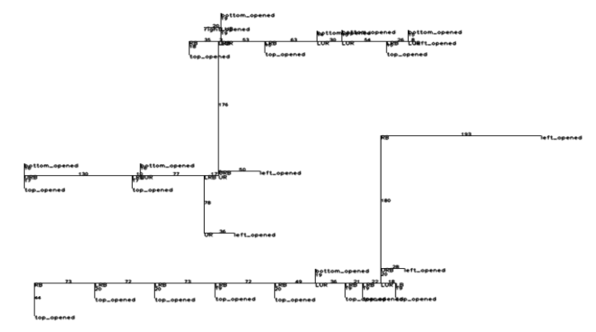
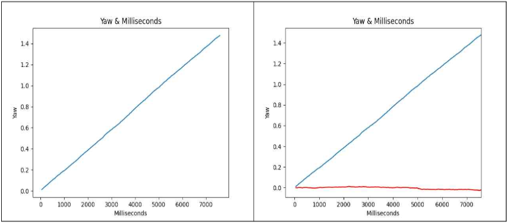

# Indoor-PDR-Navigation 📍
> **High-Precision Indoor Navigation System without GPS using Pedestrian Dead Reckoning (PDR)**

This project was developed as a Bachelor's Thesis at Inha University. It focuses on achieving precise indoor localization by fusing mobile IMU sensor data with graph-based spatial topology, specifically designed for complex environments like university buildings.

## 🎬 Live Demo

  
   
  <em>Real-time pedestrian tracking and pathfinding using Accelerometer and Gyroscope sensors.</em>

## 🏗 System Architecture
The system consists of three main pipelines: **Data Acquisition, Pre-processing (Calibration), and Localization Logic.**

### 1. Spatial Topology & Graph Construction
To enable pathfinding, we transformed 2D floor plans into a structured graph database.
- **Node/Edge Extraction:** Developed a Python tool to extract intersections and rooms as nodes.
- **Manhattan Distance Constraint:** Enforced topological constraints to ensure realistic indoor movement paths.

  
   
  <em>Figure 1: Automated extraction of nodes and edges from indoor floor plans.</em>

### 2. Sensor Fusion & Error Correction
To overcome the drift inherent in smartphone sensors, we implemented rigorous mathematical calibration.

#### A. Yaw Drift Correction (Gyroscope)
Gyroscope accuracy degrades over time. We modeled this drift using **Linear Regression** to stabilize the orientation.
- **Regression Model:** $$Y = 0.000196X - 0.003742$$
- **Result:** Successfully minimized cumulative error for long-term navigation.

  
   
  <em>Figure 2: Yaw data before and after linear regression-based calibration.</em>

#### B. Step Detection (Accelerometer)
Used **Signal Vector Magnitude (SVM)** to identify movement peaks.
- **SVM Formula:** $$SVM = \sqrt{accX^2 + accY^2 + accZ^2}$$
- **Optimized Thresholds:** Threshold1 (16.0) and Threshold2 (12.0) were determined to achieve **~99% distance accuracy**.

### 3. Positioning Logic
- **Initial Setup:** QR Code scanning defines the starting $(x_0, y_0)$ and orientation.
- **Shortest Path:** Dijkstra’s algorithm calculates the optimal route via PostgreSQL/PostGIS.
- **Dead Reckoning:** Real-time coordinate updates based on step count and yaw angle.

## 🛠 Tech Stack
- **Framework:** Flutter (Dart)
- **Language:** Python (Pandas, NetworkX)
- **Database:** PostgreSQL / PostGIS
- **Tools:** QGIS, Firebase (for initial testing)

## 📊 Performance
- **Distance Error:** < 1% (1 step error per 200 steps).
- **Directional Stability:** High stability achieved through real-time drift compensation.

## 📄 Documentation
For more technical details, experimental data, and theoretical backgrounds:
- [**Download Bachelor's Thesis (PDF - Korean)**](https://github.com/jschan0911/sensorUsingFlutter/releases/tag/thesis) 
- [**View Presentation Slides (PDF)**](./docs/IndoorNavigationPDF.pdf)